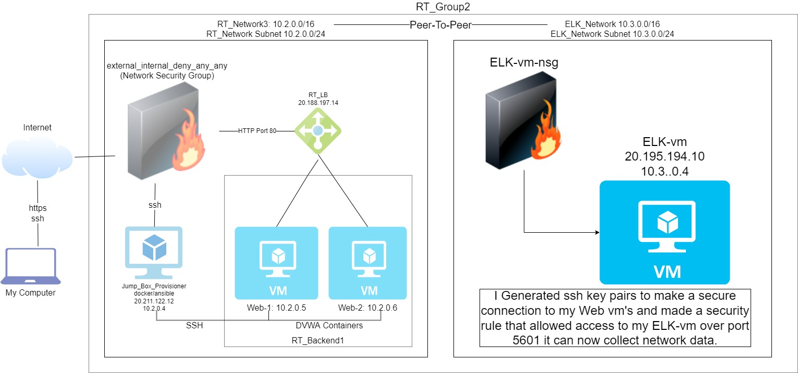

## Automated ELK Stack Deployment

The files in this repository were used to configure the network depicted below.

These files have been tested and used to generate a live ELK deployment on Azure. They can be used to either recreate the entire deployment pictured above. Alternatively, select portions of the YANL file may be used to install only certain pieces of it, such as Filebeat.

  - filebeat and meatricbeat playbook

This document contains the following details:
- Description of the Topologu
- Access Policies
- ELK Configuration
  - Beats in Use
  - Machines Being Monitored
- How to Use the Ansible Build

### Description of the Topology

The main purpose of this network is to expose a load-balanced and monitored instance of DVWA, the Damn Vulnerable Web Application.

Load balancing ensures that the application will be highly accessible, in addition to restricting traffic to the network.
- The load balaner helps to prevents DDOS of your servers by making sure the work is shared between all your servers.
- A Jumpbox is a machine we use as our single point of entry to our webservers. Having a jumpbox has multiple advantages. It is a single machine that can manage all your servers. It makes for a secure single point of entry and it makes it easier to set up multiple servers easily. In addition to all that it also makes diagnosis of problems easier because it is on a single source instead of multiple hosts.

Integrating an ELK server allows users to easily monitor the vulnerable VMs for changes to the servers and system settings.
- Filebeat helps monitor the logs of our system and put them into one place for us.
- Metricbeat helps monitor the stats and metrics of servers to help prevent downtime.

The configuration details of each machine may be found below.

| Name     | Function | IP Address | Operating System |
|----------|----------|------------|------------------|
| JumpBox  | Gateway  | 10.2.0.4   | Linux            |
| Web-1    | Webserver| 10.2.0.5   | Linux            |
| Web-2    | Webserver| 10.2.0.6   | Linux            |

### Access Policies

The machines on the internal network are not exposed to the public Internet. 

Only the Elk-vm machine can accept connections from the Internet. Access to this machine is only allowed from the following IP addresses:
- 20.188.194.14

Machines within the network can only be accessed by an administrator from a whitelisted IP.

A summary of the access policies in place can be found in the table below.

| Name     | Publicly Accessible | Allowed IP Addresses |
|----------|---------------------|----------------------|
| Jump Box | No                  | 20.188.194.14        |
|webservers| No                  | 10.2.0.4             |
| Elk-VM   | No                  | 20.188.194.14        |

### Elk Configuration

Ansible was used to automate configuration of the ELK machine. No configuration was performed manually, which is advantageous because it allows us to perform multple installs and functions quickly. Thge biggest advantage is that it is repeatable over multiple systems.

The playbook implements the following tasks:
- Installs Docker
- Installs Ansible
- Installs Python

The following screenshot displays the result of running `docker ps` after successfully configuring the ELK instance.

![Ansible Install] (elk_stack_project/'day 1 connect pic.png')

### Target Machines & Beats
This ELK server is configured to monitor the following machines:
- Web-1: 10.2.0.4
- Web-2: 10.2.0.5

We have installed the following Beats on these machines:
- Filebeat
- Metricbeat

### Using the Playbook
In order to use the playbook, you will need to have an Ansible control node already configured. Assuming you have such a control node provisioned: 

SSH into the control node and follow the steps below:
- Copy the playbook file to your machine.
- Update the configuration file to include your Webserver machines
- Run the playbook, and navigate to DVWA at port 5600 to check that the installation worked as expected.

