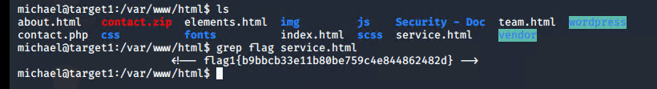
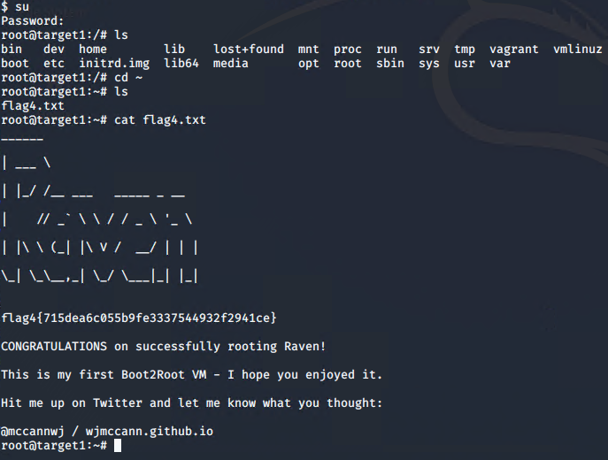

# Red Team: Summary of Operations

## Table of Contents
- Exposed Services
- Critical Vulnerabilities
- Exploitation

### Exposed Services
_TODO: Fill out the information below._

Nmap scan results for each machine reveal the below services and OS details:

This scan identifies the services below as potential points of entry:
- Target 1
  - ssh port 22
  - http port 80
  - rpcbind port 111
  - netbios-ssn port 139
  - microsoft-ds port 445

The following vulnerabilities were identified on each target:
- Target 1
  - ssh is open 
  - http is open
  - the http has a vulnerable Wordpress server

### Exploitation
_TODO: Fill out the details below. Include screenshots where possible._

The Red Team was able to penetrate `Target 1` and retrieve the following confidential data:
- Target 1
  - `flag1.txt`{b9bbcb33e11b80be759c4e844862482d}
    - **Exploit Used**
      - ssh to users host after exploting vulnerable worpress server

  - `flag2.txt`{fcfd58dcdad9ab23faca6e9a36e581c}
    - **Exploit Used**
      - vulnerable Worpress server

    `flag3.txt`{afc01ab56b5091e7dccf93122770cd2}
    - **Exploit Used**
      - using the files discovered infiltrate the MySQL server

    `flag4.txt`{715ea6c055b9fe3337544932f291ce}
    - **Exploit Used**
      - Once we have the hash values we crack them using John the Ripper

      - After John is finished we can log onto steven's user account and got root access
